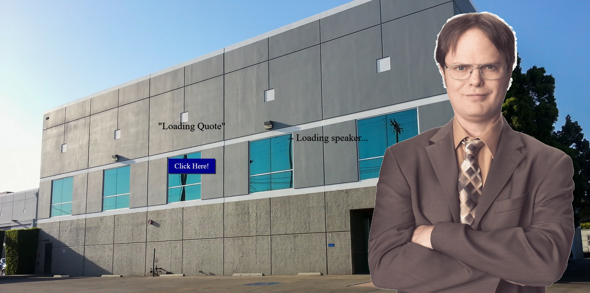

<h1 align="center">The Office Quotes</h1>

Client que gera frases da série "The office" 

Projeto criado no Bootcamp da Eduzz em parceria com a DIO

 

<code>pip3 install -r requirements.txt</code> ou para instalar as dependências do server.

<code>python3 app.py</code> para iniciar o server

<code>yarn install</code> ou para instalar as dependências do front.

<code>yarn start</code> para executar o front localmente em http://localhost:3000/

Projeto ainda não está online!

